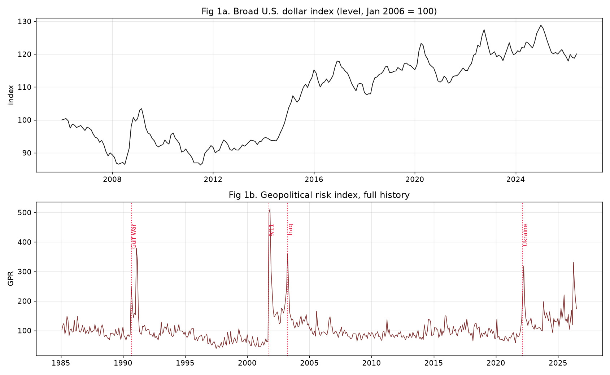
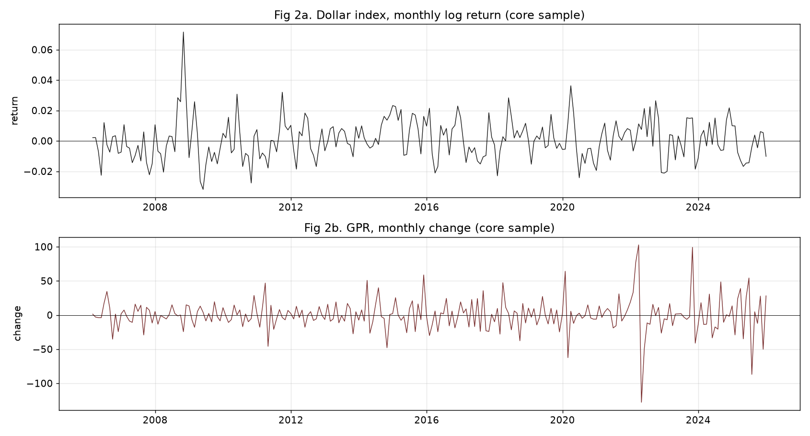
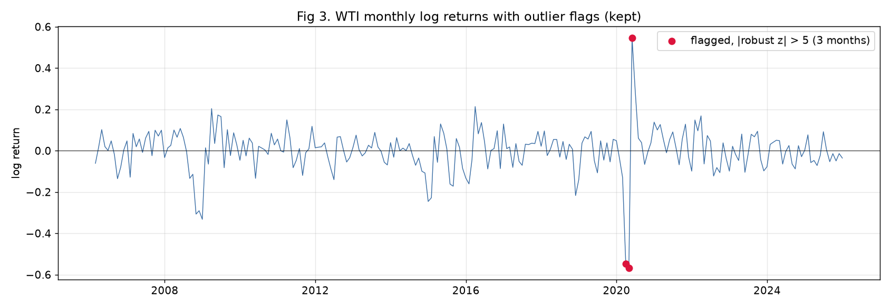
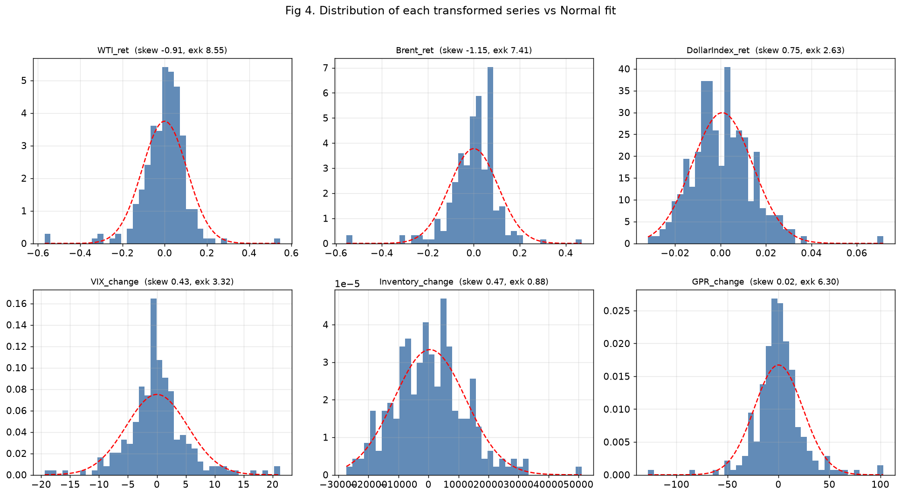
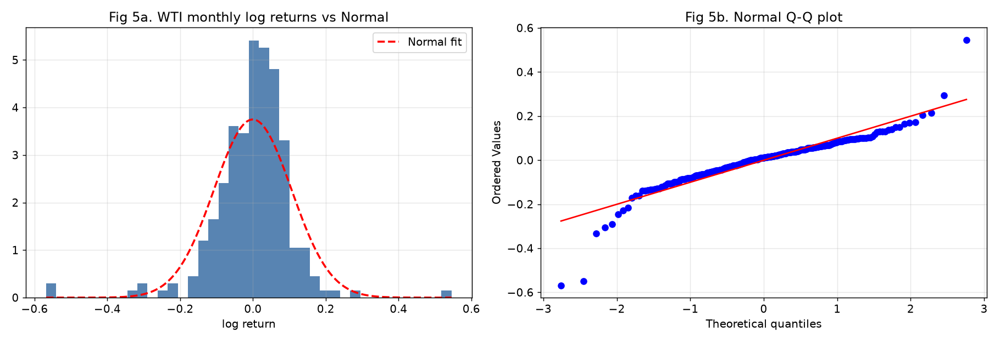
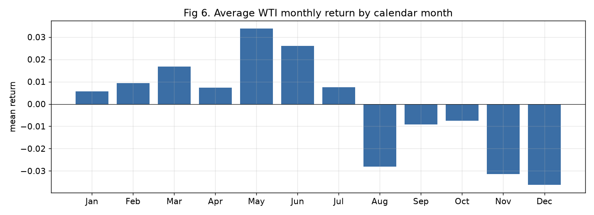

# Crude Oil Price Forecasting with Probabilistic Graphical Models
### Group Work Project 1: Problem Formulation, Data Collection, and Exploratory Analysis

| Field | Entry |
|---|---|
| **Course** | MScFE 660 Risk Management |
| **Assignment** | Group Work Project 1 |
| **Team members** | Seungeun Park (Student A); [Student B]; [Student C] |
| **Prepared by** | Seungeun Park |
| **Core sample** | 2006-02 to 2025-12, 239 monthly observations |
| **Companion files** | `GWP1_Notebook.ipynb`; `GWP1_Notebook.html` |

Sections marked "reserved for Student B/C" are left open for teammates to complete. All other sections are final.

---

## 1. Problem Formulation

### 1.1 Problem addressed by the thesis

The problem is to forecast crude oil price states in a setting where several drivers move together and where the relationships may change during stress periods. A plain one-variable price model is too narrow for this task. Oil prices respond to market benchmarks, currency conditions, risk appetite, inventories, and geopolitical risk. The purpose of this GWP1 report is therefore not to claim a final causal model, but to prepare a clean variable panel for Bayesian-network development.

### 1.2 Why Bayesian networks fit the problem

Bayesian networks are useful because they express multivariate dependence through nodes, directed edges, and conditional probability tables. That structure is easier to interpret than a black-box regression when the research question is about how oil-price states are associated with candidate drivers. The network also allows future scenario questions, such as how the probability of a WTI down month changes when the dollar strengthens and geopolitical risk is high.

### 1.3 Advantages of the methodology

The main advantage is that the method can combine data evidence with domain restrictions. In this report, same-month dependence statistics are treated as screening evidence. Predictive timing is left for later model validation. This avoids overstating the early-stage evidence while still giving GWP2 a coherent set of candidate parents for WTI return state.

## 2. Data collection and variable dictionary

### 2.1 Macroeconomic and geopolitical variables (Student A)

Two of the panel variables are Student A's responsibility.

The broad U.S. dollar index comes from FRED (series TWEXBGSMTH). Oil is priced in dollars, so a stronger dollar tends to weigh on the barrel for buyers outside the United States. The raw index begins in January 2006. That start date is what fixes the core sample at 2006-02 onward. The trade-off was discussed in the group: the currency channel was judged worth more to the model than the pre-2006 oil history it costs, which includes the 1990 Gulf War and the late-1990s price collapse.

The geopolitical risk index of Caldara and Iacoviello counts news coverage of war, terror and sanctions. It is available from 1985. The series does not trend. It jumps on events and then decays, which is visible across its full history in Figure 1. The Gulf War, 9/11, the Iraq invasion and the 2022 invasion of Ukraine all appear as sharp spikes. In the core sample the largest monthly changes fall on February to April 2022 and on October 2023.



**Figure 1. The dollar index (level) and the geopolitical risk index (full history), with major events marked.**

Both series were aligned to the monthly grid and transformed, the dollar to monthly log returns and GPR to level and monthly change (Figure 2). The dollar return moves inversely with the WTI return in the core sample, with a correlation of about -0.44. This is the strongest non-oil link in the panel. GPR behaves as a state variable rather than a smooth level, which fits the plan to discretize the drivers before the network stage.



**Figure 2. Dollar monthly log return and GPR monthly change over the core sample.**

**[ Reserved for Student B: the microeconomic variable (U.S. crude inventories excluding SPR), its economic role, import and structure. ]**

**[ Reserved for Student C: the financial variables (VIX; Brent as benchmark), their economic role, import and structure. ]**

### 2.2 Data dictionary (Step 4, group)

**Table 1. Data dictionary.**

| Series | Group | Frequency | Unit | Transformation | Source | Raw start | Raw end | Model start | Model end |
|---|---|---|---|---|---|---|---|---|---|
| WTI spot price | Target | Monthly | USD/bbl | Level, log return | EIA-based file | 1986-01 | 2026-06 | 2006-02 | 2025-12 |
| Brent spot price | Benchmark | Monthly | USD/bbl | Level, log return | EIA-based file | 1987-05 | 2026-06 | 2006-02 | 2025-12 |
| U.S. dollar index | Macro | Monthly | Index (2006-01=100) | Log return | FRED TWEXBGSMTH | 2006-01 | 2026-06 | 2006-02 | 2025-12 |
| VIX | Financial | Monthly | Index | Monthly change | CBOE monthly file | 1990-01 | 2026-07 | 2006-02 | 2025-12 |
| Crude inventories ex SPR | Physical | Weekly to monthly avg | kbbl | Monthly change | EIA WCESTUS1 | 1982-08 | 2026-06 | 2006-02 | 2025-12 |
| GPR index | Geopolitical | Monthly | Index | Level, monthly change | Caldara-Iacoviello | 1985-01 | 2026-06 | 2006-02 | 2025-12 |

Observations after December 2025 exist in the raw files but are kept out of the core panel, because recent months can still be revised.

## 3. Data cleaning

### 3.1 Extreme-outlier screening on all series (Step 5, Student A)

Each observation receives a robust z-score built from the median and the median absolute deviation instead of the mean and standard deviation. The reason is practical. The mean and the standard deviation are themselves pulled around by the outliers the screen is trying to find, so a plain z-score under-flags in the months that matter most. A month is flagged when its absolute score is above 5.

Flagged months are reviewed and kept, not deleted. In this market the extreme observations are usually real events. Deleting 2020 would remove the most informative stress episode in the sample.

The screen flags 15 observations across the six transformed series (Table 2). Each one lands on a recognisable event. None looks like a mechanical error: there are no isolated ten-fold jumps, no impossible signs, and no values detached from their neighbours.

**Table 2. Flagged observations, absolute robust z above 5.**

| Month | Series | Value | Robust z | Event |
|---|---|---:|---:|---|
| 2020-03 | WTI return | -0.5483 | -7.15 | Pandemic demand collapse |
| 2020-04 | WTI return | -0.5681 | -7.40 | Pandemic, storage stress |
| 2020-05 | WTI return | +0.5456 | +6.84 | Reopening rebound |
| 2020-03 | Brent return | -0.5532 | -6.68 | Pandemic |
| 2020-04 | Brent return | -0.5548 | -6.70 | Pandemic |
| 2020-05 | Brent return | +0.4691 | +5.42 | Rebound |
| 2008-10 | Dollar return | +0.0716 | +5.92 | Crisis flight to the dollar |
| 2008-09 | VIX change | +18.74 | +5.28 | Lehman failure |
| 2008-10 | VIX change | +20.50 | +5.77 | Peak crisis stress |
| 2020-02 | VIX change | +21.27 | +5.98 | Pandemic shock |
| 2020-04 | VIX change | -19.39 | -5.26 | Stress unwind |
| 2022-03 | GPR change | +102.80 | +6.57 | Invasion of Ukraine |
| 2022-04 | GPR change | -127.81 | -8.06 | Post-invasion decay |
| 2023-10 | GPR change | +99.25 | +6.35 | Middle East conflict |
| 2025-07 | GPR change | -86.91 | -5.47 | Risk normalisation |



**Figure 3. WTI monthly log returns with the outlier flags. Flagged months are kept in the panel.**

**[ Reserved for Student B: bad-data checks on all series, covering non-positive prices, duplicated dates and inconsistent joins. ]**

**[ Reserved for Student C: missing-value treatment on all series, with the chosen imputation or interpolation method and its justification. ]**

### 3.2 The sterilized panel (Step 6, group)

The model panel combines the three cleaning passes. Rows are dropped only when a transformation leaves a variable undefined: the first month of each return series, the first six months of the rolling volatility window, and everything before 2006-02 where the dollar index does not exist. The final panel has 239 complete monthly rows, no missing values in the model variables, no non-positive prices and no duplicated dates. The stress months flagged in Step 5 remain in the data on purpose, since they carry the tail behaviour a risk model has to learn.

## 4. Exploratory data analysis

### 4.1 Distributional plots for all datasets (Step 7, Student A)

Figure 4 shows one histogram per transformed series, each against its own Normal fit. Figure 5 looks at the target more closely. Table 3 collects the moments.



**Figure 4. Distribution of each transformed series against a Normal fit, with skew and excess kurtosis in each title.**

**Table 3. Distribution summary, core sample.**

| Series | Mean | Std | Skew | Excess kurtosis | Min | Max |
|---|---:|---:|---:|---:|---:|---:|
| WTI return | -0.0005 | 0.1065 | -0.91 | 8.55 | -0.568 | 0.546 |
| Brent return | -0.0000 | 0.1056 | -1.15 | 7.41 | -0.555 | 0.469 |
| Dollar return | 0.0008 | 0.0133 | +0.75 | 2.63 | -0.032 | 0.072 |
| VIX change | 0.0084 | 5.32 | +0.43 | 3.32 | -19.4 | 21.3 |
| Inventory change | 504 | 11,969 | +0.47 | 0.88 | -27,362 | 51,047 |
| GPR change | 0.16 | 23.9 | +0.02 | 6.30 | -127.8 | 102.8 |

The target is the least Normal series in the panel. WTI returns carry skewness near -0.9 and excess kurtosis near 8.6, against zero for a Normal distribution. The histogram is more peaked than the Normal fit and the Q-Q plot in Figure 5 bends away from the reference line at both ends. The skews also point in opposite directions across the panel. The oil benchmarks skew negative, since crashes are larger than rallies, while the dollar, the VIX and GPR skew positive, since stress variables spike upward. The same event that produces an extreme negative oil month tends to produce extreme positive months in those three. The inventory change is the closest to Normal, with excess kurtosis below one.



**Figure 5. WTI monthly log returns: histogram with Normal fit and Normal Q-Q plot.**

**[ Reserved for Student B: time-series plots for all datasets. ]**

**[ Reserved for Student C: multivariate plots for all datasets. ]**

## 5. Step 8 questions (group)

### 5.1 What makes oil prices look different from other asset prices?

The return series is dominated by event months. The 2008 crisis, the 2014-15 supply glut and the 2020 pandemic all appear as single-month moves of 25 to 57 percent, and turbulent months arrive in clusters rather than alone. Oil also has a physical side that most financial assets lack, since storage and inventories tie the price to real barrels. The calendar-month averages in Figure 6 move around, with stronger spring months and weaker year-ends in this sample, though the pattern is not stable enough to use on its own.



**Figure 6. Average WTI monthly return by calendar month, core sample.**

### 5.2 What types of distributions do oil returns have?

Fat-tailed and left-skewed. The moments in Table 3 and the plots in Figures 4 and 5 show a distribution far from Normal: skewness near -0.9 and excess kurtosis near 8.6. A Normal assumption would understate the probability of large losses, which is the error a risk model can least afford.

### 5.3 What type of autocorrelation do the oil returns have?

**Table 4. Autocorrelation of returns and squared returns.**

| Lag | 1 | 2 | 3 | 4 | 5 | 6 |
|---|---:|---:|---:|---:|---:|---:|
| Return | 0.29 | -0.03 | -0.12 | -0.11 | -0.03 | -0.03 |
| Squared return | 0.71 | 0.37 | 0.07 | -0.03 | -0.03 | -0.03 |

Returns show some positive autocorrelation at the first lag and little after that. Squared returns are much more persistent, at 0.71 for the first lag and 0.37 for the second. The size of a move is predictable even where its direction is not. This is volatility clustering, and it supports keeping a rolling-volatility state among the candidate drivers.

### 5.4 What other stylized facts can be stated?

WTI and Brent move almost one for one within the month, with a return correlation of 0.96, so the benchmark carries description rather than forecasting value. The dollar is inversely related to oil at about -0.44. The stress variables lean the opposite way from oil, since the dollar, the VIX and GPR all jump upward in the months when oil crashes. Finally, the flagged months of Table 2 account for most of the tail mass, so any model built on this panel has to remain usable through them.

## 6. Model concepts for the Bayesian-network stage

### 6.1 Probabilistic graphical models: belief networks and Markov networks (Step 9, Student A)

A probabilistic graphical model represents a joint probability distribution with a graph. Nodes are random variables and edges are direct dependencies. A missing edge states a conditional independence, and that is what makes the model workable. The joint distribution over this panel's variables is far too large to estimate from 239 observations, but the graph breaks it into small local pieces that can be estimated one at a time. The assumptions also sit in the open, where the group can question them before the model is used.

A belief network, also called a Bayesian network, is built on a directed acyclic graph. Each node holds a conditional probability table given its parents, and the joint distribution is the product of those tables. Direction lets the graph state one-way claims, for example that a geopolitical shock raises the probability of an extreme oil month. It also supports evidence updating: fix the observed nodes and read off the conditional distribution of the target. That matches the question this project asks about the WTI return state.

A Markov network uses an undirected graph. Edges stand for symmetric association, the joint distribution factorises over cliques through potential functions, and a normalising constant is required. It suits problems where dependence has no natural direction, such as spatial data. What it cannot do is say which way an influence runs.

The group therefore works with a belief network. The undirected view still appears inside the procedure, because structure learning first recovers an undirected skeleton from independence tests and only then orients the edges.

**[ Reserved for Student B: parameter learning and how it differs from structure learning. ]**

**[ Reserved for Student C: Markov chains and Markov blankets. ]**

## 7. Inferred-causality pseudocode (Step 10, group)

```
Input : cleaned monthly panel D, target Y = WTI_return_state,
        conditional-independence test CI(a, b | S)
Output: candidate directed acyclic graph G

1. Start from the complete undirected graph over the panel variables.
2. For each adjacent pair (a, b), search for a conditioning set S such that
   CI(a, b | S) holds. If one is found, remove the edge a - b and record S
   as the separating set of (a, b).
3. For each triple a - c - b where a and b are not adjacent:
   if c is not in the separating set of (a, b), orient a -> c <- b.
4. Propagate orientations: do not create directed cycles and do not create
   new colliders that step 3 did not identify.
5. Apply timing restrictions: lagged variables may point at Y; Y may not
   point back at variables observed earlier.
6. Return G and estimate the conditional probability tables on it.
```

The output is a candidate structure for GWP2. An edge recovered this way is a hypothesis consistent with the independence pattern in the data, not proof of economic causation.

---

## Works Cited

Alvi, Danish A. *Application of Probabilistic Graphical Models in Forecasting Crude Oil Price.* 2018. University College London, Dissertation.

Board of Governors of the Federal Reserve System (US). "Nominal Broad U.S. Dollar Index [TWEXBGSMTH]." *FRED*, Federal Reserve Bank of St. Louis.

Caldara, Dario, and Matteo Iacoviello. "Measuring Geopolitical Risk." *American Economic Review*, vol. 112, no. 4, 2022, pp. 1194-1225.

Chicago Board Options Exchange. "CBOE Volatility Index (VIX)." Monthly data file.

U.S. Energy Information Administration. "Weekly U.S. Ending Stocks excluding SPR of Crude Oil [WCESTUS1]." *EIA Petroleum and Other Liquids.*

Datasets Project. "Oil Prices: Brent and WTI Monthly Spot Prices." GitHub dataset based on EIA source data.
