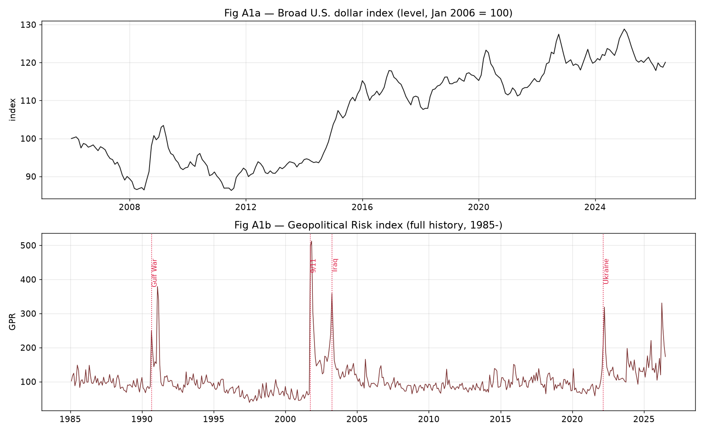
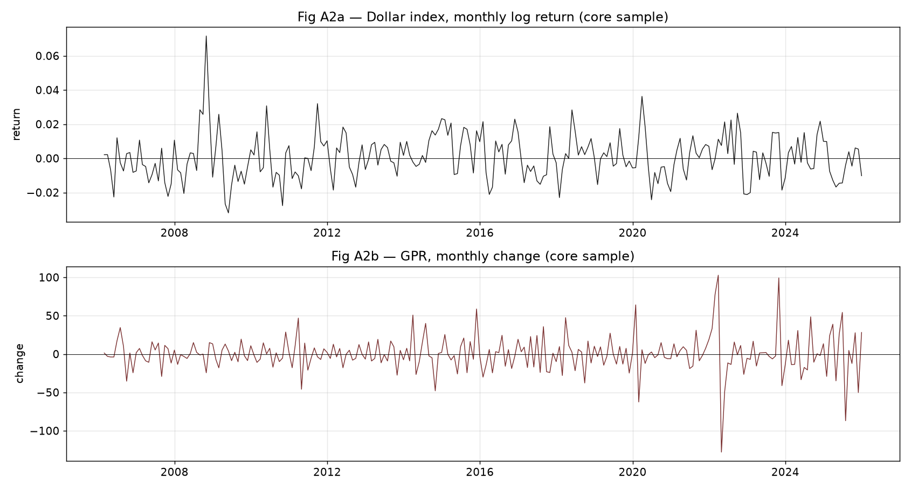
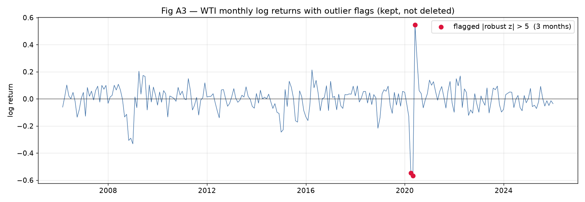
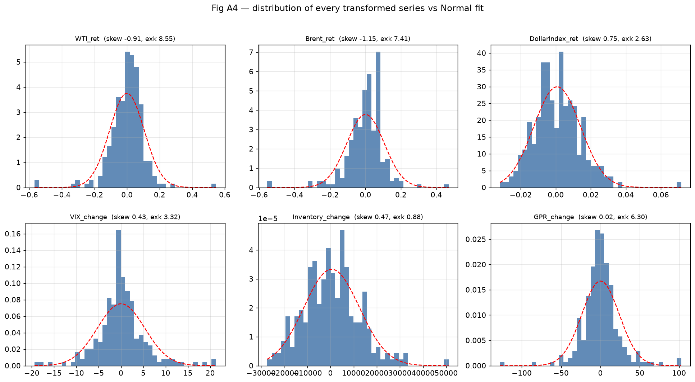
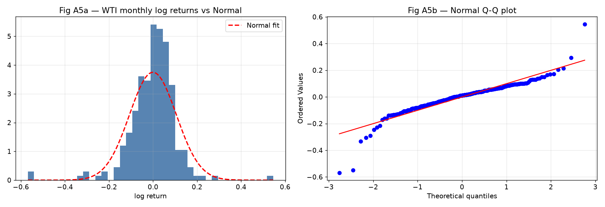

# GWP1 — Student A Contribution
### Macroeconomic and Geopolitical Variables, Outlier Screening, and Distributional Analysis

| Field | Entry |
|---|---|
| **Course** | MScFE 660 Risk Management |
| **Assignment** | Group Work Project 1 — individual contribution |
| **Role** | Student A: macroeconomic / geopolitical specialist |
| **Prepared by** | Seungeun Park |
| **Core sample** | 2006-02 to 2025-12, 239 monthly observations |
| **Companion file** | `GWP1_StudentA_Notebook.ipynb` (executed; HTML copy included) |

---

## 1. Problem Formulation

### 1.1 Problem addressed by the thesis

The problem is to forecast crude oil price states in a setting where several
drivers move together and where the relationships may change during stress
periods. A plain one-variable price model is too narrow for this task. Oil
prices respond to market benchmarks, currency conditions, risk appetite,
inventories, and geopolitical risk. The purpose of this GWP1 report is
therefore not to claim a final causal model, but to prepare a clean variable
panel for Bayesian-network development.

### 1.2 Why Bayesian networks fit the problem

Bayesian networks are useful because they express multivariate dependence
through nodes, directed edges, and conditional probability tables. That
structure is easier to interpret than a black-box regression when the research
question is about how oil-price states are associated with candidate drivers.
The network also allows future scenario questions, such as how the probability
of a WTI down month changes when the dollar strengthens and geopolitical risk
is high.

### 1.3 Advantages of the methodology

The main advantage is that the method can combine data evidence with domain
restrictions. In this report, same-month dependence statistics are treated as
screening evidence. Predictive timing is left for later model validation. This
avoids overstating the early-stage evidence while still giving GWP2 a coherent
set of candidate parents for WTI return state.

## 2. Macroeconomic and geopolitical variables (Step 3)

Two series in the group panel fall under Student A's specialism.

**Broad U.S. dollar index** (FRED `TWEXBGSMTH`; macroeconomic). Crude oil is
priced in dollars, so a stronger dollar mechanically pressures the barrel for
non-dollar buyers. The raw index begins in January 2006, and that start date is
what pins the group's core sample to 2006-02 onward — a trade-off the group
accepted because the currency channel is worth more to the model than the
pre-2006 oil history it costs.

**Geopolitical Risk index** (Caldara and Iacoviello; geopolitical). A news-based
count of war, terror and sanction coverage, available from 1985. Its full
history (Figure A1b) shows the character of the series: it does not trend, it
spikes. The Gulf War, 9/11, the Iraq invasion and the 2022 invasion of Ukraine
all appear as sharp jumps followed by decay. In the core sample the largest
monthly changes land on February–April 2022 and on October 2023.

**Figure A1 — Student A variables in levels: broad U.S. dollar index and the GPR index (full history), with major geopolitical events marked.**

Both series were imported from their raw files, aligned to the group's monthly
grid, and transformed — the dollar to monthly log-returns, GPR to level and
monthly change (Figure A2). Two structuring observations matter for the
model stage. First, the dollar return shows the expected inverse relationship
with WTI returns, about **−0.44** in the core sample, the strongest single
non-oil link in the panel. Second, GPR's spike-and-decay shape means it carries
information as a *state* (calm / elevated / extreme) rather than as a smooth
level, which supports the group's decision to discretize every driver before
the Bayesian-network stage.

**Figure A2 — Structured to the core sample: dollar monthly log-return and GPR monthly change.**

## 3. Extreme-outlier screening on all series (Step 5)

Student A's cleaning responsibility is the extreme-outlier check, applied to
every transformed series in the panel: WTI and Brent returns, the dollar
return, the VIX change, the inventory change and the GPR change.

**Method.** Each observation receives a **modified z-score** built from the
median and the median absolute deviation (MAD) rather than the mean and
standard deviation. The reason is practical: the mean and standard deviation
are themselves distorted by the outliers the screen is looking for, so a plain
z-score under-flags exactly when it matters. A month is flagged when the
absolute modified z-score exceeds 5.

**Rule.** Flagged months are reviewed, not deleted. In oil data the extreme
observations are usually the point — deleting 2020 would remove the single most
informative stress episode in the sample.

**Findings.** The screen flags 15 observations across the six series
(Table A1). Every one of them lands on a recognisable market event, and none
looks like a mechanical error: no isolated ten-fold jumps, no impossible signs,
no values detached from their neighbours.

**Table A1 — Flagged observations, |modified z| > 5.**

| Month | Series | Value | Robust z | Event |
|---|---|---:|---:|---|
| 2020-03 | WTI return | −0.5483 | −7.15 | COVID demand collapse |
| 2020-04 | WTI return | −0.5681 | −7.40 | COVID / storage stress |
| 2020-05 | WTI return | +0.5456 | +6.84 | Reopening rebound |
| 2020-03 | Brent return | −0.5532 | −6.68 | COVID |
| 2020-04 | Brent return | −0.5548 | −6.70 | COVID |
| 2020-05 | Brent return | +0.4691 | +5.42 | Rebound |
| 2008-10 | Dollar return | +0.0716 | +5.92 | GFC flight to dollar |
| 2008-09 | VIX change | +18.74 | +5.28 | Lehman |
| 2008-10 | VIX change | +20.50 | +5.77 | GFC peak stress |
| 2020-02 | VIX change | +21.27 | +5.98 | COVID shock |
| 2020-04 | VIX change | −19.39 | −5.26 | Stress unwind |
| 2022-03 | GPR change | +102.80 | +6.57 | Invasion of Ukraine |
| 2022-04 | GPR change | −127.81 | −8.06 | Post-invasion decay |
| 2023-10 | GPR change | +99.25 | +6.35 | Middle East conflict |
| 2025-07 | GPR change | −86.91 | −5.47 | Risk normalisation |

The recommendation passed to the group: keep all fifteen months. The flags are
handed to Student B, whose bad-data check covers the mechanical problems
(non-positive prices, duplicates), and to Student C for the missing-value
treatment. Figure A3 shows the flags overlaid on the WTI return series.

**Figure A3 — WTI monthly log-returns with the outlier flags. Flagged months are reviewed and kept, not deleted.**

## 4. Distributional analysis of all datasets (Step 7)

Student A's EDA lens is the shape of each variable's distribution. Figure A4
shows a histogram of every transformed series against its Normal fit, Figure A5
gives the target a closer look with a Normal overlay and a Q-Q plot, and
Table A2 collects the moments.

**Figure A4 — Distribution of every transformed series against its Normal fit (skew and excess kurtosis in each title).**

**Table A2 — Distribution summary, core sample (239 months).**

| Series | Mean | Std | Skew | Excess kurtosis | Min | Max |
|---|---:|---:|---:|---:|---:|---:|
| WTI return | −0.0005 | 0.1065 | −0.91 | 8.55 | −0.568 | 0.546 |
| Brent return | −0.0000 | 0.1056 | −1.15 | 7.41 | −0.555 | 0.469 |
| Dollar return | 0.0008 | 0.0133 | +0.75 | 2.63 | −0.032 | 0.072 |
| VIX change | 0.0084 | 5.32 | +0.43 | 3.32 | −19.4 | 21.3 |
| Inventory change | 504 | 11,969 | +0.47 | 0.88 | −27,362 | 51,047 |
| GPR change | 0.16 | 23.9 | +0.02 | 6.30 | −127.8 | 102.8 |

Three observations. First, the target is the worst-behaved series in the panel:
WTI returns are left-skewed (−0.91) with excess kurtosis of 8.55, and a
Jarque–Bera test rejects Normality at any conventional level. The Q-Q plot
(Figure A5) bends off the reference line at both ends — the visual signature of
fat tails.

**Figure A5 — WTI monthly log-returns: histogram with Normal overlay (left) and Normal Q-Q plot (right).**
Second, the skews are not all the same direction. The oil benchmarks skew
*negative* (crashes are bigger than rallies), while the dollar, the VIX and GPR
skew *positive* — stress variables spike upward. That asymmetry is economically
sensible: the same event that produces an extreme negative oil month produces
an extreme positive dollar, VIX and GPR month. Third, the inventory change is
the closest thing to a Normal variable in the panel (excess kurtosis 0.88),
which is what one would expect from a smoothed physical-stock series.

The practical conclusion for the group: no Gaussian assumption survives this
panel. That finding is what justifies moving to discretized states —
Down/Flat/Up for the target, Low/Medium/High for drivers — before the
Bayesian-network stage, since conditional probability tables make no
distributional assumption at all.

## 5. Probabilistic graphical models: belief networks and Markov networks (Step 9)

**What a PGM is.** A probabilistic graphical model represents a joint
probability distribution with a graph. Nodes are random variables; edges mark
direct probabilistic dependence; and — the part that does the real work — a
*missing* edge is a statement of conditional independence. This matters because
a joint distribution over even a handful of discretized variables is too large
to estimate honestly from 239 monthly observations. The graph factorises that
joint distribution into small local pieces, each estimable on its own, and it
does so in a form a human can read and challenge. If the graph asserts
something economically absurd, the group can see it and fix it before the model
is used, which is not true of most black-box alternatives.

**Belief networks.** A belief network — the term Bayesian network is used
interchangeably — is built on a *directed acyclic graph*. Each node carries a
conditional probability distribution given its parents, and the joint
distribution factorises as the product of those local distributions. Two
properties follow from the direction of the edges. First, the graph can express
asymmetric relationships: "a geopolitical-risk spike raises the probability of
an extreme oil month" is a directed statement, and the reverse claim is a
different edge. Second, the network supports *evidence updating*: fix the
observed nodes (the dollar strengthened, GPR is elevated), and the conditional
distribution of the target node follows from the factorisation. That is
precisely the scenario question a risk desk asks, and it is why the group's
project is framed around this family.

**Markov networks.** A Markov network — also called a Markov random field —
uses an *undirected* graph. Edges represent symmetric association; the joint
distribution factorises over the graph's cliques through non-negative potential
functions; and because potentials are not probabilities, a normalising constant
(the partition function) is required, which is often the expensive part.
Markov networks are the natural tool where dependence has no direction —
spatial data, image models, contemporaneous co-movement between market
variables. What they cannot do, by construction, is say which way an influence
runs.

**How the two relate in this project.** The distinction is not a ranking; it is
a division of labour. The group's forecasting question — how does the WTI
return state respond to observed driver states — needs direction, so the model
of record is a belief network. But the undirected view still appears inside the
workflow: constraint-based structure learning first recovers an undirected
*skeleton* from conditional-independence tests, and only then orients edges
(colliders first, then propagation rules). The skeleton phase is, in effect, a
Markov-network view of the data that the algorithm subsequently sharpens into a
belief network. One caution belongs in the record: a directed edge recovered
this way is a modelling hypothesis consistent with the data's independence
structure, not proof of economic causation, and the group's report treats it
that way throughout.

---

## Works Cited

Alvi, Danish A. *Application of Probabilistic Graphical Models in Forecasting
Crude Oil Price.* 2018. University College London, Dissertation.

Board of Governors of the Federal Reserve System (US). "Nominal Broad U.S.
Dollar Index [TWEXBGSMTH]." *FRED*, Federal Reserve Bank of St. Louis.

Caldara, Dario, and Matteo Iacoviello. "Measuring Geopolitical Risk."
*American Economic Review*, vol. 112, no. 4, 2022, pp. 1194–1225.

Koller, Daphne, and Nir Friedman. *Probabilistic Graphical Models: Principles
and Techniques.* MIT Press, 2009.

U.S. Energy Information Administration. "Petroleum & Other Liquids." *EIA*,
www.eia.gov/petroleum/data.php.
